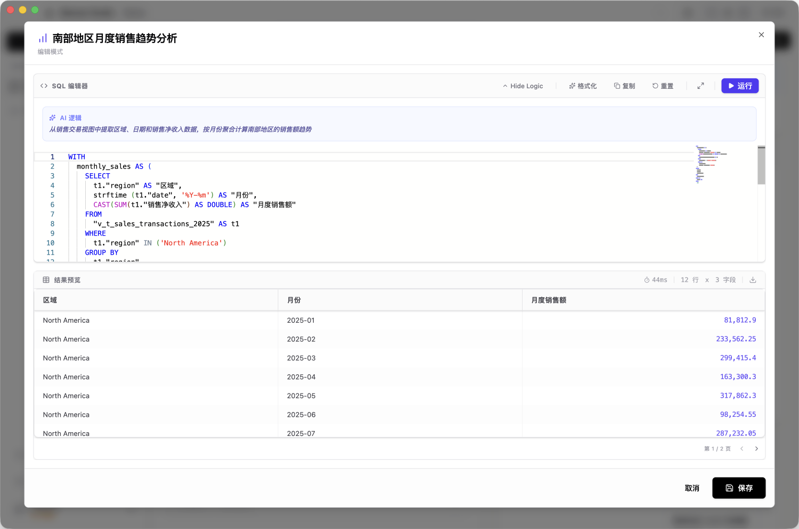

# SQL 工作台与高级查询

虽然 Wansan 强调 AI 驱动，但我们也为专业分析师提供了完整的 **SQL 工作台** 能力。您可以直接操作底层的分析引擎，进行复杂的自定义查询。

---

## 1. 数据预览面板

当您在“数据资产”模式下选中一个文件时，右侧会自动开启 **数据预览面板**。

*   **即时预览**：系统会自动为您生成基础查询语句，帮助您快速了解数据。
*   **状态感应**：面板会实时反馈数据的加载状态，包括上传进度和错误诊断。
*   **交互式查询**：您可以直接在编辑器中修改代码并执行，探索文件的原始明细。

---

## 2. 全局 SQL 实验室 (SQL Lab)

您可以从分析卡片的“代码”图标进入该功能。它是处理复杂逻辑的专业空间。

*   **逻辑溯源**：查看 AI 生成这段代码时的思考逻辑。
*   **实时保存**：修改代码并保存后，对应的图表卡片会立即同步更新。

---

## 3. 🛠 语法指南：Wansan 使用什么 SQL？

Wansan Studio 底层采用 **DuckDB** 作为高性能分析引擎。如果您习惯使用其他数据库，请注意以下关键差异：

### 兼容性
它的语法高度兼容 **PostgreSQL**。绝大多数标准 PostgreSQL 语句都可以直接运行。

### 引号规范 (与 MySQL 的主要差异)
*   **双引号 `"`**：用于引用 **表名或列名**（例如：`SELECT "销售额" FROM "订单表"`）。
*   **单引号 `'`**：用于引用 **具体的文字或值**（例如：`WHERE 城市 = '北京'`）。
*   *注意：不支持 MySQL 的反引号 `` ` ``。*

### 数据处理建议
*   **日期格式**：对日期进行计算时，建议使用标准的转换函数，如 `CAST('2024-01-01' AS DATE)`。
*   **高级函数**：它支持丰富的内置函数，包括正则表达式、地理空间计算和高级窗口函数，适合处理大规模分析任务。

> **安全提示**：SQL 环境经过安全加固，所有的查询操作都是“只读安全”的，不会对您的原始物理文件造成任何损坏。
