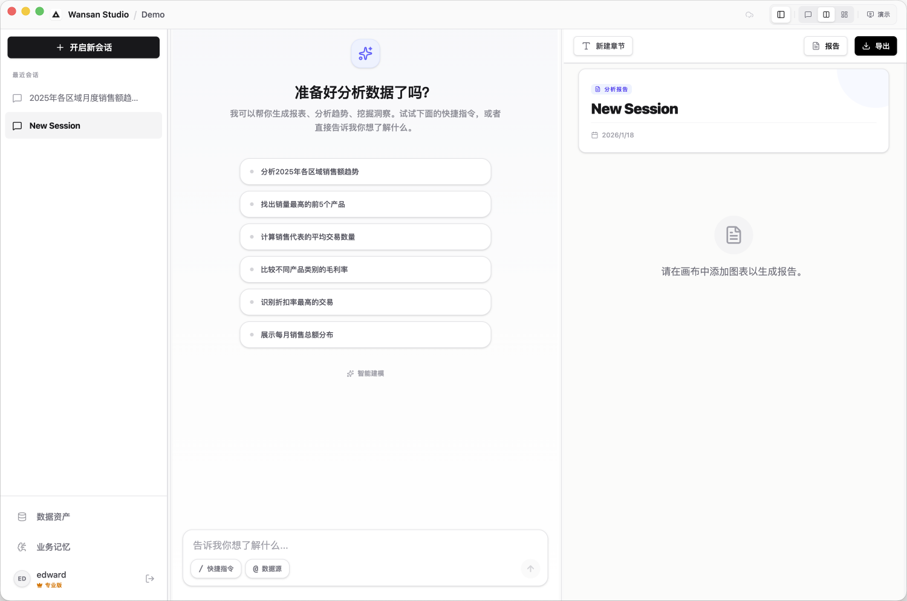
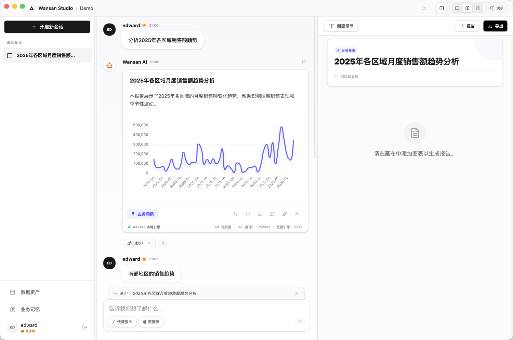
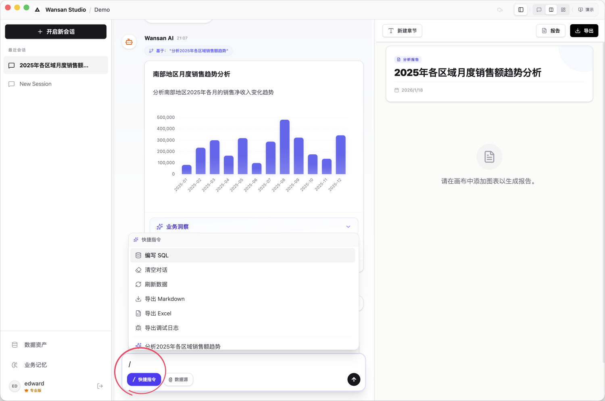
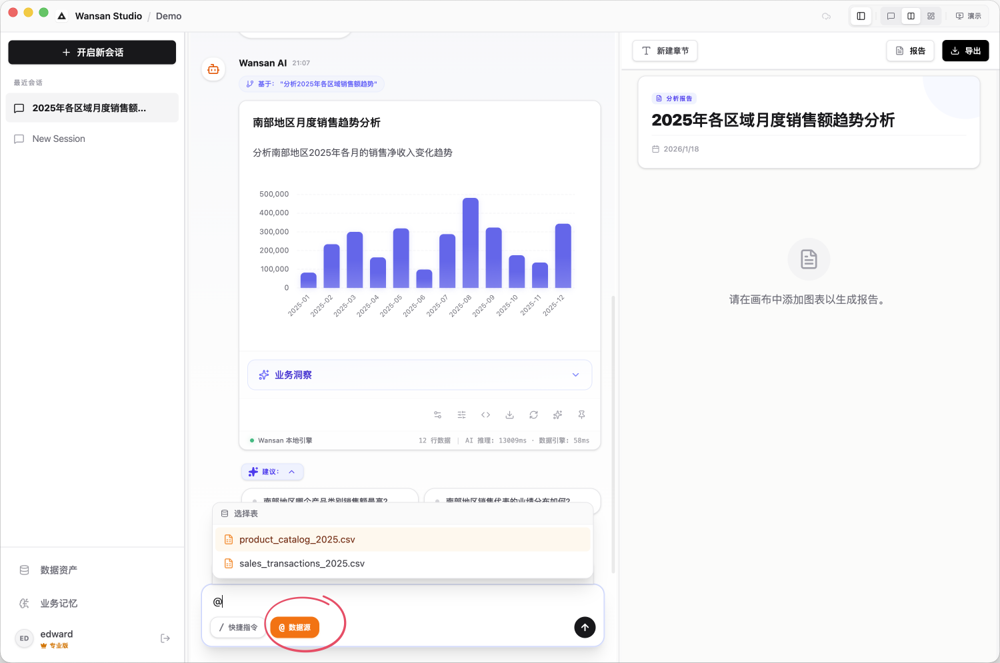
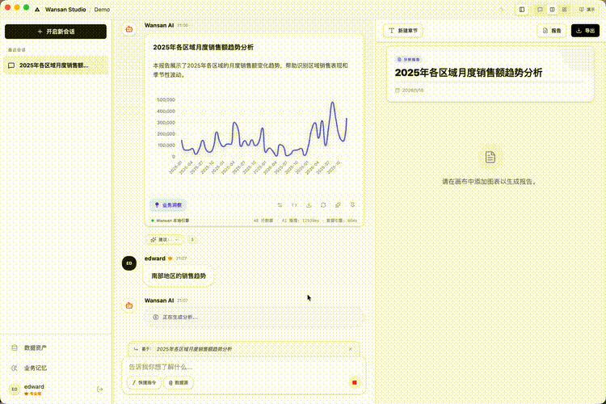
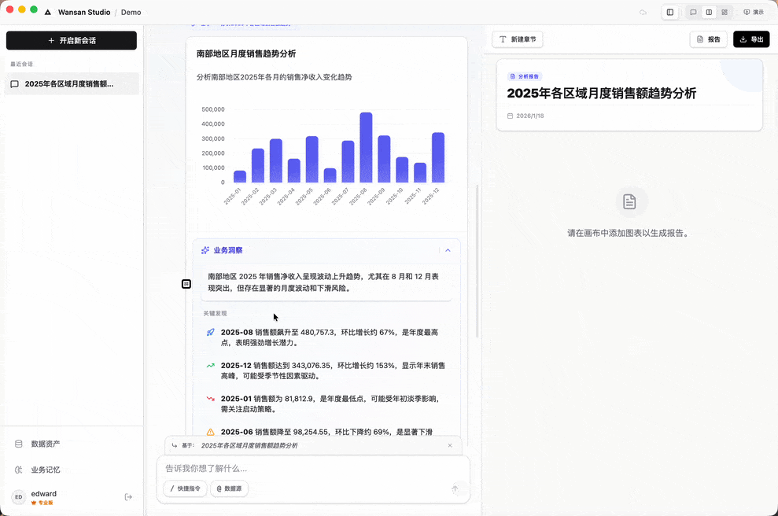
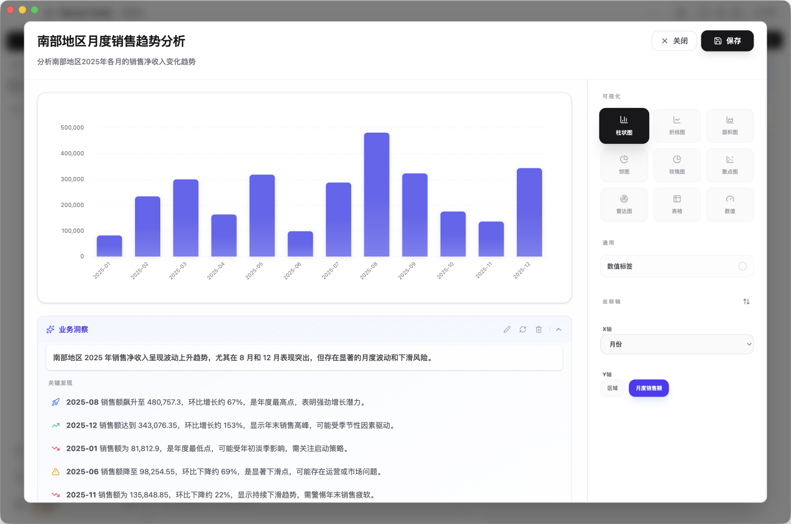

# 对话分析与交互

这是 Wansan 的主要工作区。您可以通过输入文字与数据进行交互，并对生成的图表进行调整。

## 0. 启发式分析建议
当您进入一个没有任何聊天记录的新会话时，屏幕中心会显示一组针对当前数据的 **“分析建议”**。

*   **量身定制**：这些建议是 AI 根据您导入的文件名称和列名特征生成的，旨在引导您发现数据的潜在价值。
*   **一键启动**：如果您没有明确的问题，只需点击感兴趣的建议气泡，AI 就会立即开始第一轮分析。

---

## 1. 基础对话与智能处理
在输入框中描述您的需求（例如：“统计上季度的销售额”）。

*   **自动计算**：系统会根据描述，自动选择最适合的计算方式。
*   **自动修正 (Self-Fix)**：AI 并不总是完美的，在分析复杂的表格时可能会写错公式。如果计算报错，系统会提供一个 **“自动修正”** 按钮。点击后，AI 会重新思考错误原因并尝试修复逻辑。
*   **连续对话**：当您发起追问时，系统会自动将上一条分析结果作为背景。输入框上方会显示“基于：xxx 进行分析”的提示，确保对话逻辑连贯。
*   **省钱与隐私**：Wansan 不会发送您的原始数据行。它只会将必要的表结构和当前的分析逻辑发送给 AI。这不仅保护隐私，还能**显著节省 API 费用的消耗**（Token 占用极低）。

---

## 2. 输入框快捷指令
您可以在输入框中使用快捷符号来快速执行特定操作或指定分析范围。输入符号后，系统会弹出对应的功能列表供您选择。

### 快捷操作 (输入 `/`)
*   **会话管理**：
    *   `清理对话`：一键清空当前窗口的所有聊天记录。
    *   `问题建议`：查看 AI 根据当前数据为您推荐的分析问题。
*   **导出成果**：
    *   `导出记录`：将对话过程保存为 Markdown 文档。
    *   `导出数据`：将对话中所有图表的汇总数据保存为 Excel 表格。
*   **诊断支持**：
    *   `导出调试日志`：生成技术诊断文件，用于向支持团队反馈问题。

### 数据进阶 (输入 `/`)
*   **刷新图表**：当您在“资产管理”中更新了数据后，通过此命令一键更新当前会话中的所有分析结果。
*   **手动 SQL**：开启专业编辑器，跳过对话直接手动编写数据库查询指令。

### 指定切入点 (输入 `@`)
*   **引导 AI 聚焦**：如果您导入了多个文件，提问时输入 `@` 并选择文件名。这能为 AI 提供一个明确的 **“切入点”**。
*   **解决歧义**：在数据表较多时，使用 `@` 能帮助 AI 快速锁定您当前最关注的对象，确保分析逻辑从正确的表开始构建，避免因表名相似或关联复杂而产生的误解。

---

## 3. 使用筛选器 (Smart Filters) —— 拒绝 AI 瞎猜
当您的提问涉及具体的产品名称、城市或特定数值时，Wansan 不会让 AI 凭空“猜测”这些具体信息。

*   **保障准确性**：通过筛选器，您直接从本地真实的数据列表中勾选，确保分析结果 100% 准确。
*   **点选即看**：您只需在弹出的列表中勾选需要的项（支持多选），图表就会立即基于这些精确选中的内容实时更新。

*   **自动处理**：您无需担心拼写或复杂的格式问题，勾选后系统会自动为您处理好后台的所有逻辑。
*   **记忆功能**：您的筛选选择会被系统记住，方便随时回来微调或在下次分析中沿用。
*   **未来展望**：我们计划引入“向量化”技术，让筛选器支持语义搜索。即便您输入的关键词与数据中的文字不完全一致，系统也能帮您精准匹配。

---

## 4. 获取 AI 结论 (Insights)
图表生成后，点击左下角的 **"业务洞察"** 按钮。
*   **文字总结**：AI 会生成一段关于当前图表的深度业务分析。
*   **图表联动**：当您的鼠标滑过 AI 的结论时，图表中对应的数据点会实时高亮显示。

---

## 5. 深度微调与分工
点击分析卡片下方的 **“编辑”** 按钮，会进入一个全屏的 **“深度微调空间”**。

### 全方位的编辑能力
这不仅仅是修改图表样式，您可以对这条分析记录进行全方位的精修：
*   **标题与摘要**：直接修改分析的标题和副标题，让结论表达更精准。
*   **图表重构**：在柱状图、折线图、饼图甚至数字大卡片之间自由切换，并手动调整横纵轴。
*   **分析文案精修**：您可以直接修改 AI 生成的业务结论。编辑器支持 **Markdown** 格式（如加粗、列表等），您可以像写文档一样为您生成的图表补充背景说明。

### “分析区”与“展示区”的分工
为了保证工作流的清晰，Wansan 建议您遵循以下分工：
1.  **在对话区（分析区）完成精修**：所有的图表微调、文字描述修改，都建议在对话区的分析卡片上通过“编辑”功能完成。**请放心，您的所有修改都会实时同步到 [报告画布](./report-dashboard.md) 中，无需重复操作。**
2.  **固定到报告画布（展示区）**：点击“固定”图标，将该条分析记录“借调”到右侧的画布中。在这里，您将专注于整体的排版布局和最终导出。

---

## 6. 其他工具与导出
*   **修改参数**：重新唤起筛选窗口，更改对比内容。
*   **导出**：将当前卡片保存为高清图片，或导出原始数据表格 (CSV)。
*   **固定 (Pin)**：将这张卡片收藏到报告画布中。

> **高级功能**：点击“代码”图标可以查看底层的 SQL 语句及其思考过程（Reasoning）。如果您了解 SQL，可以在此手动修改查询逻辑。
