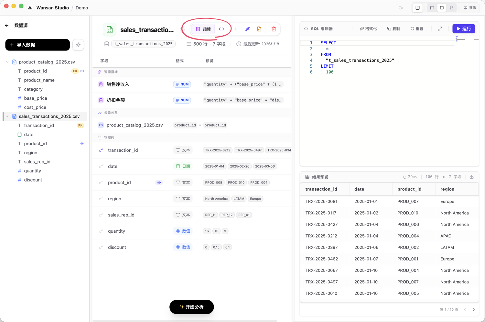
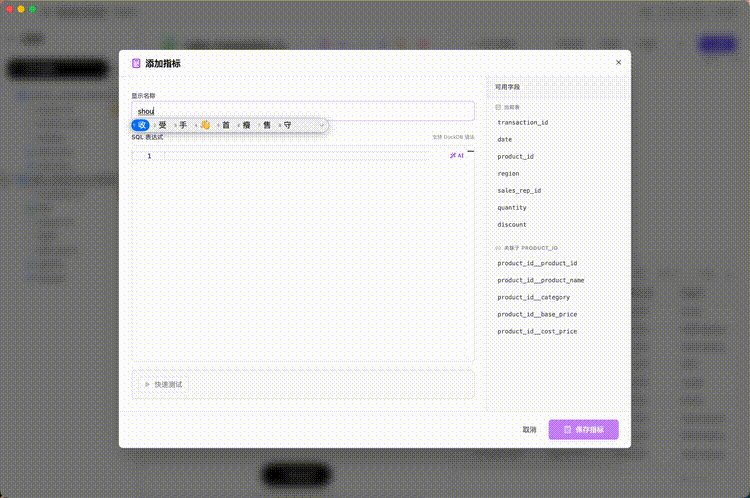

# 数据资产管理 (Schema Editor)

在侧边栏进入 **Data Assets** 并选择具体文件后，您将进入 **资产编辑器**。

> ⚠️ **重要：关于数据同步**
> Wansan 会将数据导入到本地数据库中运行。因此，**如果您在外部修改了 Excel 文件，软件内不会自动更新。** 您需要使用下方的“数据维护”功能手动同步。

---

## 主要功能

### 1. 智能指标 (Smart Metric)
您可以把这里理解为“预设公式库”。
*   **作用**：如果您定义了 `利润 = 销售额 - 成本`，后续分析时 AI 就会直接使用这个公式，避免每次都要重新说明。
*   **AI 辅助生成**：您可以直接用大白话描述需求（例如：“计算毛利率”），AI 会自动构建计算公式。
*   **交互式微调**：如果生成的公式需要调整，您不需要删除重来。**您可以直接在现有公式后面继续用自然语言写下需求**（例如在销售额公式后写上“再减去折扣”），然后再次点击 AI 按钮，AI 会“聪明”的帮你微调计算公式。

### 2. 表关联 (Link)
类似于 Excel 的 VLOOKUP。
*   **作用**：将两张表通过共同字段（如“客户ID”）连接起来。连接后，您可以进行跨表的综合分析。

### 3. 数据维护
当原始文件发生变化时，使用以下功能更新数据：
*   **追加 (Append)**：将新数据添加到现有数据后面。
*   **纠错 (Correct Data)**：根据主键（如订单号）更新已有的数据行。
*   **替换 (Replace)**：用新文件完全替换旧文件，但保留已设置的指标和关联。

---

### 4. AI 建模助手：让 AI 帮您梳理数据
当您导入新文件后，Wansan 会启动一个 **“建模确认”** 流程。AI 会预先扫描您的数据特征，并给出三类建议，您可以根据实际业务需求进行勾选确认：

*   **自动关联建议**：AI 会识别不同文件之间隐藏的联系（例如“订单表”里的“客户编号”与“客户信息表”里的“ID”）。它会告诉您建立关联的理由，并在您确认后自动完成[表关联](#2-表关联-link)设置。
*   **业务指标建议**：AI 会根据您的字段内容，猜想您可能需要的计算公式。比如它看到有“点击量”和“下单量”，就会建议您建立一个名为“转化率”的[智能指标](#1-智能指标-smart-metric)。您可以直接看到 AI 编写的底层公式，确认无误后再采纳。
*   **提问灵感建议**：AI 会为您准备好几个最值得探索的分析问题。一旦勾选，这些问题就会出现在对话框的快捷建议中，帮您快速起步。

### 核心特性
*   **透明的推荐理由**：每一条建议下方都有 AI 的“思考逻辑”，解释它为什么要这样推荐。
*   **置信度参考**：系统会标注推荐的可靠程度（百分比），帮您辅助决策。
*   **完全可控**：您可以一键采纳所有高可靠性的建议，也可以逐条筛选，确保您的“数据大脑”完全符合真实的业务逻辑。
