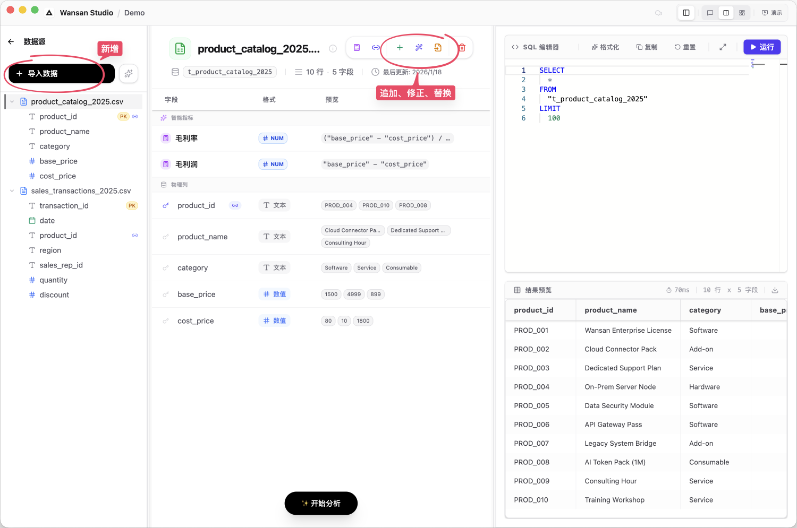
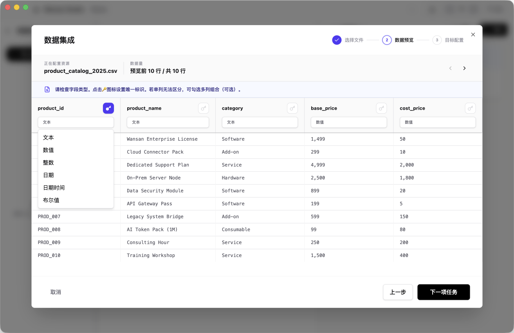

# 数据导入向导

数据导入向导是您将本地文件（Excel, CSV, JSON）接入 Wansan 的必经之路。它不仅负责搬运数据，还会通过 AI 辅助您确保数据的准确性。

---

## 选择适合您的导入模式

在开始导入前，请根据您的业务场景选择最匹配的操作方式。更多后续管理请参考 [数据资产管理](./data-assets.md)。

### 1. 新增 (Import) —— “我有一张新表格”
这是最常用的模式。当您需要分析一个全新的文件时，请使用此项。
*   **自动识别属性**：本地引擎会自动识别每一列的类型（如：数字、日期等）。**请注意，自动识别不一定 100% 准确，建议您在预览阶段仔细核对。**
*   **自定义表名**：您可以为这张表起个好记的名字，方便后续向 AI 提问。

### 2. 追加数据 (Append) —— “我想加上本月新数据”
当您的基础表没变，只是多了新的记录（例如在原有销售表里增加 1 月份的新流水）时，使用此模式。
*   **自动对齐**：系统会检查新旧文件的列是否匹配，确保数据能正确地“接”在末尾。

### 3. 数据修正 (Merge) —— “我要修改旧的错误记录”
如果您发现之前导入的数据有误，或者需要更新某些记录的状态，请使用此模式。
*   **主键比对**：系统会根据您设定的“唯一身份证（主键）”自动对比。如果新旧文件里 ID 一致，则覆盖更新；如果 ID 是新的，则作为新行插入。

### 4. 替换数据 (Replace) —— “我彻底换了新文件”
如果您原本分析的是“2023年数据”，现在想换成“2024年全量数据”，且希望保留之前的图表布局和计算公式，请使用此模式。
*   **一键更新**：底层数据完全更替，但您辛苦定义的分析逻辑依然有效。

---

## 导入的三步标准流程

无论选择哪种模式，都会经历以下三个步骤：

1.  **选择文件**：支持多文件同时拖入。对于大型文件，系统会实时显示读取进度。
2.  **预览与配置**：系统会展示数据的前 100 行供您参考。**这是非常关键的一步：** 如果您发现某些列的类型不对（例如“日期”被识别成了“文字”），请务必在此手动调整，以确保后续分析的准确性。您也可以在此标记“主键”。
3.  **智能校验**：在正式写入前，本地引擎会进行最后的验证。如果发现格式错误（如数字列里有文字），会弹出 **诊断窗口** 引导您修复原始文件。

---

## 规格说明
*   **导入上限**：试用版单次支持 50,000 行；专业版支持百万级大数据。
*   **隐私安全**：所有导入操作完全在您的电脑本地执行。原始数据**绝不发送给 AI**，仅用于本地计算。
