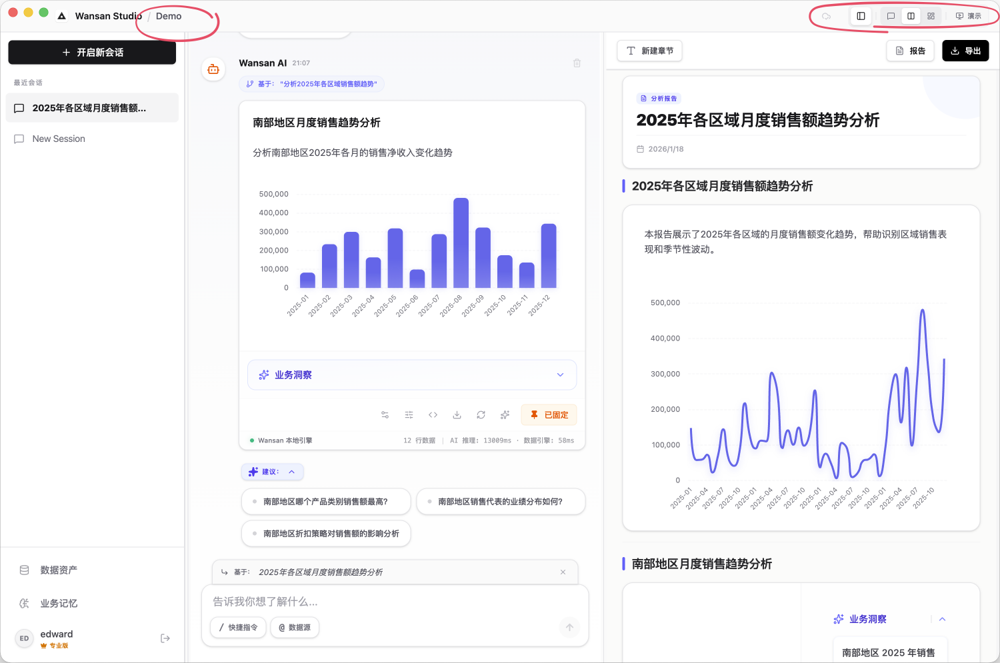

# 界面布局与演示模式

Wansan Studio 采用 **“三栏式”** 布局，旨在为您提供一个从“数据探索”到“结果呈现”的平滑视野。

您可以通过调整界面的展示重心，在不同的分析阶段获得最佳的视觉体验。

---

## 1. 调整您的工作视野

界面的三个区域分工明确，您可以根据需要调整它们的显示比例：

### 顶层视角切换 (Chat vs Dashboard)
这是控制界面“重心”的开关：
*   **分析优先 (Chat Mode)**：让中栏的对话窗口成为视觉重心。适合您正忙于和 AI 进行高频互动、快速提问的阶段。
*   **展示优先 (Dashboard Mode)**：让右栏的报告画布全面展开。适合您已经完成了一系列分析，想要从头到尾审视整份分析成果的整体感。

### 侧边栏开合 (管理 vs 专注)
*   **展开侧边栏**：适合日常操作，方便您随时在不同的历史对话或数据文件间切换。
*   **收起侧边栏**：进入“专注模式”。此时左侧是推导过程，右侧是最终成果，非常适合现场演示或深度复核。

---

## 2. 全屏演示模式

当您需要向团队展示最终成果时，可以利用全屏能力进入纯净的汇报状态：

*   **沉浸式汇报**：您可以收起所有管理面板，让报告铺满整个屏幕。
*   **实时互动**：演示过程中，所有的图表依然保留交互能力（如悬浮查看数值）。如果您在左侧微调了分析结论，右侧的全屏画布会实时同步更新。
*   **脱离运行**：如果您希望在没有安装软件的电脑上演示，请通过 [Web 报告导出](./report-dashboard.md#4-报告导出-export) 生成独立网页，该网页同样支持全屏演示。

---

## 3. 状态感知：项目信息与自动保存

为了让您专注于分析，系统在界面中提供了必要的状态反馈：

*   **项目名称**：在界面边缘清晰展示当前所在的项目名称，避免在多个工作区中混淆。
*   **自动保存 (Auto-save)**：Wansan 遵循“修改即生效”原则。您在左侧进行的任何文字精修或公式改动，系统都会**实时自动保存**到本地磁盘，并同步反映在右侧的展示区中。

> **核心分工提示**：请记住，**所有的“改动”都在左侧完成，右侧仅负责“展示”**。如果您发现右侧的某个图表需要调整，请直接在左侧对应的分析卡片上进行操作。