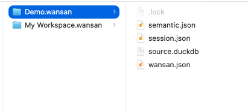

# 项目结构与存储 (Directory Bundle)

Wansan Studio 采用 **Directory Bundle (目录包)** 架构。您的每一个“项目”在磁盘上都表现为一个以 `.wansan` 结尾的独立文件夹。

这种自包含的设计确保了您的数据分析成果是**原生的、可移植的且绝对隐私的**。

---

## 项目包内部构成

如果您在文件系统中查看 `.wansan` 文件夹内部，会发现以下关键文件：

### 1. `wansan.json` (项目锚点)
这是项目的身份证。记录了项目元数据（名称、创建时间）、资产清单（原始文件路径）以及基础配置。

### 2. `source.duckdb` (核心数据库)
这是项目的“心脏”。所有导入的数据、聚合表都以高性能二进制格式物理存储在此。它支持百万级数据的高性能本地索引，且绝不离开您的设备。

### 3. `session.json` (对话与布局)
记录了您的 AI 聊天历史、图表配置、分析指令快照以及画布上的排版布局。

### 4. `semantic.json` (语义层)
存储了独立于物理数据的逻辑资产，包括表与表之间的关联关系以及您定义的自定义计算指标。

### 5. `.lock` (运行锁)
用于防止多个程序实例同时操作同一个项目，确保数据库文件的安全性。

---

## 核心优势

1.  **完全掌控**：项目数据以文件形式存在，您可以像管理普通文档一样进行移动、备份或分享。
2.  **秒级加载**：由于采用了原生本地存储，再次打开项目时无需重新导入数据，实现即开即用。
3.  **自由云同步**：您可以直接将 `.wansan` 文件夹存放在 **iCloud、OneDrive、Dropbox、百度网盘** 等同步盘中，或者使用 **Git** 进行版本管理。您不需要依赖 Wansan 提供的任何服务，即可在多台设备间同步您的分析进度。*（注：云同步的准确性、版本冲突处理及文件一致性由您选择的同步服务决定）*
4.  **结构化逻辑**：通过将“物理数据”与“业务逻辑”分离，即便您更换了底层数据文件，只要结构一致，所有的分析配置都能无缝继承。

> **Local-First 提示**：Wansan 并不“托管”您的数据，它只是为您提供管理这些 `.wansan` 包的工具。您的数据主权始终掌握在自己手中。
