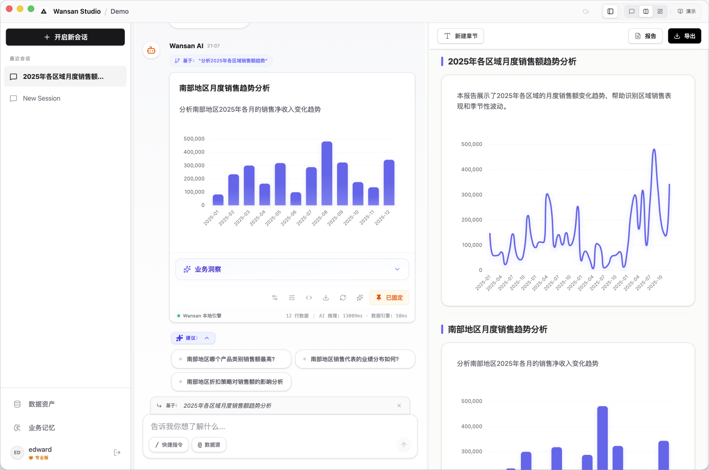
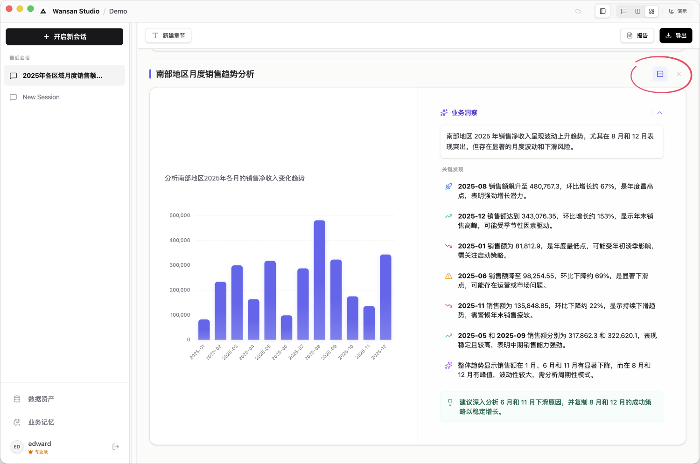

# 报告模式与画布管理

Wansan Studio 提供了一个专门用于整理分析成果的区域——**报告画布**。

您可以将它理解为一个“展示间”：在这里，您不再进行复杂的逻辑分析，而是专注于将已经生成的分析成果组合成一份逻辑严密的正式报告。

## 1. 核心视图：报告模式 (Report Mode)

这是 Wansan 推荐的默认分析视图，专为生成连贯、易读的业务报告设计。

*   **专注展示**：在此模式下，所有的图表和文字按纵向排列，最符合阅读直觉。
*   **灵活组织**：您可以直接拖拽卡片调整先后顺序，或添加章节标题来分隔内容。
*   **Web 导出前提**：只有在“报告模式”下，您才能将报告发布为可交互的网页。

---

## 2. 理解“分析区”与“展示区”的分工

为了保持操作的清晰，Wansan 采用了“展示与分析分离”的设计模式：

*   **对话区（分析中心）**：这是您的“工作室”。**所有的深度修改**——包括更换图表类型、生成/微调 AI 洞察、修改底层 SQL 公式等，都应当在对话区的 [分析卡片](./chat-analysis.md#5-图表调整与导出) 上完成。
*   **报告画布（展示中心）**：这里仅处理排版逻辑。如果您在画布上点击“编辑”，通常是为了微调该卡片在报告中的显示标题，或进入全屏预览。

---

## 3. 常用工具说明

### 插入章节标题 (New Section)
点击工具栏左侧的 **"New Section"** 按钮。
*   **作用**：它仅作为视觉上的“分隔符”，用于标记报告的不同部分（如：“第一部分：财务综述”）。它能帮助读者快速理解报告的结构。

### 布局模式 (Layout Mode)
您可以根据图表的内容和复杂度，在卡片右上角一键切换布局：
*   **上下流式 (Flow)**：默认模式。图表在上，AI 结论在下。这种模式排版整齐，适合包含大量数据点的复杂图表。
*   **左右对照 (Split)**：图表与 AI 结论左右并排展示。这种模式非常适合进行深度业务解读，读者可以一边观察图表走势，一边阅读文字结论，对比体验更佳。

### 视图切换 (View Switcher)
*   **报告视图 (Report)**：排版最清爽，适合屏幕演示和 Web 导出。
*   **打印布局 (A4)**：完全模拟纸张大小，专为导出 PDF 设计。

---

## 4. 报告导出 (Export)

*   **独立 Web 报告 (.html)**：[重点推荐] 生成一个交互式网页，别人双击就能看，且保留图表互动。
*   **Excel 导出**：将报告中所有图表的汇总数据打包导出。
*   **PDF / 图片**：适合正式发送或发到沟通群中。
