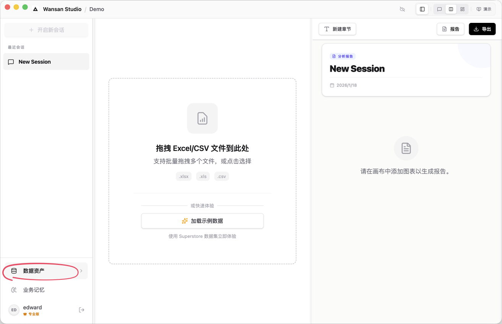

# 侧边栏与导航

侧边栏是 Wansan 的核心导航区，通过“对话”与“数据”两种模式，平衡了日常分析与底层治理。

## 模式切换

侧边栏支持在“分析”与“管理”两种角色间切换：

### 1. 对话模式 (Sessions) —— 日常分析
这是您的默认视图，用于管理所有的 AI 聊天历史。具体交互与分析技巧请参考 [对话分析与交互](./chat-analysis.md)。
*   **新建对话**：点击顶部按钮开启新分析。*注意：必须先导入数据资产。*
*   **历史记录 (History)**：按时间倒序排列您的所有分析会话。

### 2. 资产模式 (Data Sources) —— 深度治理
点击底部的 **"Data Assets"** 进入。此模式用于管理数据源的物理属性与逻辑关系，更多详情请参考 [数据资产管理](./data-assets.md)。

---

## 底部功能区 (Footer)

侧边栏底部整合了用户状态与全局规则入口：

*   **业务规则 (Business Rules)**：配置全局分析指令，让 AI 学习您的业务逻辑。详细配置方法请查看 [业务规则与领域记忆](./business-rules.md)。
*   **用户与许可**：显示当前用户名及激活状态（Trial / Pro Active / Enterprise）。
*   **退出项目**：点击登出图标，安全关闭当前项目并返回 [项目启动器](../getting-started/launcher.md)。
