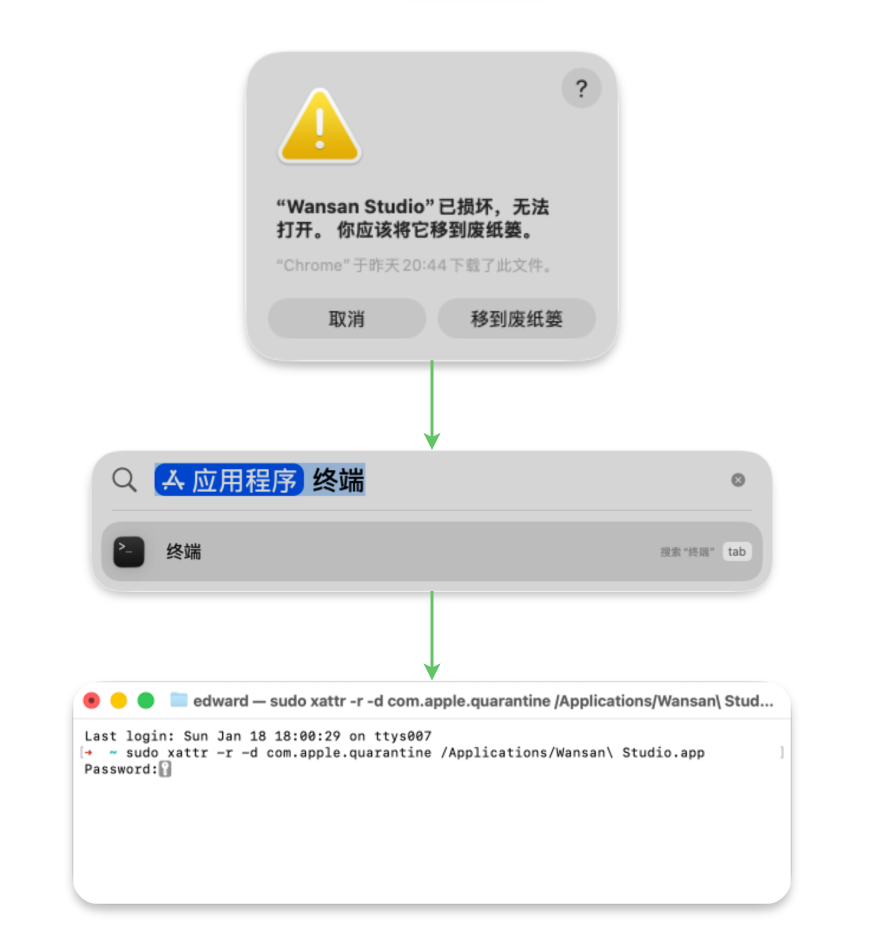

# 安装 Wansan Studio

Wansan Studio 支持 Windows 和 macOS 系统。

## macOS 安装

1.  从 [发布页面](https://github.com/your-repo/releases) 下载 `.dmg` 文件。
2.  打开 `.dmg` 并将 Wansan Studio 拖入 **Applications** 文件夹。

---

## 🛠 常见问题：提示“应用已损坏”？

在 macOS 上打开 Wansan 时，如果您看到 **“Wansan Studio 已损坏，打不开”** 的警告，请不要担心，这通常不是应用本身的问题。

### 为什么会这样？
这是 macOS 的 **Gatekeeper** 安全机制导致的。目前 Wansan Studio 处于测试阶段，暂未进行 Apple 官方认证。**我们将在正式版发布时完成相关的公证 (Notarization) 流程**。

### 解决方案：使用终端一键修复
如果系统提示损坏，请按照以下步骤操作：

1. 打开 **终端 (Terminal)**。
2. 复制并粘贴以下命令（注意末尾有一个空格）：
    `sudo xattr -r -d com.apple.quarantine /Applications/Wansan\ Studio.app`
3. 按回车键，并输入您的开机密码确认。
4. **重新启动 Wansan** 即可正常运行。

---

## Windows 安装

1.  下载 `.exe` 安装程序。
2.  双击运行。如果弹出 Windows Defender 提醒，点击 **“更多信息” -> “仍要运行”**。
3.  按照提示完成安装，桌面将自动生成快捷方式。

## 系统要求

*   **内存**: 至少 4GB (推荐 8GB 以上)。
*   **存储**: 约 500MB 安装空间 (包含本地数据库引擎)。
*   **系统**: macOS 12+ (Monterey) 或 Windows 10+。
