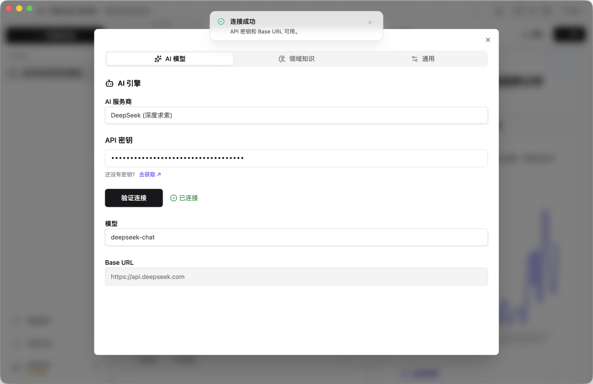

# 配置 AI 服务 (必读)

进入 Wansan 的分析空间后，第一步操作是为它配置一个分析引擎。Wansan 需要连接 DeepSeek 或 OpenAI 才能处理您的分析指令。

我们推荐使用 **DeepSeek**，它不仅在国内访问稳定，且 API 调用成本极低。更重要的是，DeepSeek 在 SQL 生成和逻辑推理方面表现卓越，非常适合 Wansan 这种基于数据库的专业分析场景。

## 为什么需要我自己配置？
*   **隐私安全**：您直接与 AI 厂商连接，数据不经过我们的服务器。
*   **没有差价**：我们不转售 API，您直接按出厂价付费。
*   **成本透明**：DeepSeek 的价格极低（百万 token 仅需 1 元左右）。**充值 10 元人民币，通常足够个人用户高频使用 1-3 个月。**

## 配置步骤

### 第一步：获取 API Key
1.  访问 [DeepSeek 开放平台](https://platform.deepseek.com) 并注册/登录。
2.  确保账户内有余额（通常充值 10 元即可使用较长时间）。
3.  在 **API Keys** 菜单中创建一个新的 Key，并复制 `sk-` 开头的字符串。

### 第二步：在软件中填入
1.  打开 Wansan Studio，点击左下角的 **设置 (Settings)** 图标。
2.  在 **AI 模型** 页面：
    *   **AI 服务商**: 选择 `DeepSeek` (推荐) 或 `OpenAI`。
    *   **API 迷药**: 粘贴刚才复制的 Key。
    *   **模型**: 选择具体的 AI 模型。
        *   **DeepSeek (推荐)**: 建议初次使用选择 `deepseek-chat`。
        *   **OpenAI**: 建议选择 `gpt-4o`。
3.  点击 **"验证链接"**。

---

### 💡 额外说明：不同模型有什么区别？
如果您在模型列表中看到多个选项，可以参考以下原则：
*   **通用型 (如 deepseek-chat)**：速度快、性价比极高，能搞定 90% 的日常分析任务。
*   **推理型 (如 deepseek-reasoner)**：在正式回答前会进行“深度思考”。虽然速度慢一些，但在处理极其复杂的数学逻辑或跨多张表的关联分析时，准确率更高。

### 第三步：验证
如果显示绿色的 `Connected` 提示，说明配置成功，您可以开始导入数据分析了。

---

## 常见问题
*   **支持哪些服务商？**
    *   **内置推荐**：软件已预设 DeepSeek 和 OpenAI，填入 Key 即可一键连接。
    *   **自定义接入**：支持任何符合标准接口规范（OpenAI API 规范）的服务商。您可以选择“Custom”模式，并填写服务商提供的 Base URL。
*   **数据安全说明**：分析请求直接发送给您配置的服务商，不经过 Wansan 的服务器。您的数据隐私得到物理层面的保障。
